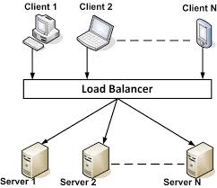

# HOW TO RUN :
  -first run PubSub.java
  -then run workerMain.java
  -Enter IP and PORT ( ip:127.0.0.1 , port: 19999)
  -Run client enter (the same ip and port)
  ( there is a test in which 100 clients will be asking for worker )
  - most of the changes that I made was related to RL in QlearningLoadBalancer class , Policy class and  ....
  (read QlearningLoadBalancer.py and RL package in Server)
# Reinforcement Learning
In each epoch performance is observed , some workers and clients are run and
according to this observation weighs(W) are updated based on calculated rewardthen. Then new action allocates resourses to workers
 
# Load balancing for CPU
It is one of the open issues that OS developers face , related to distribution of tasks between processing units in operating system

RL can play a significant role in associating these jobs , resulting in less time consumption

